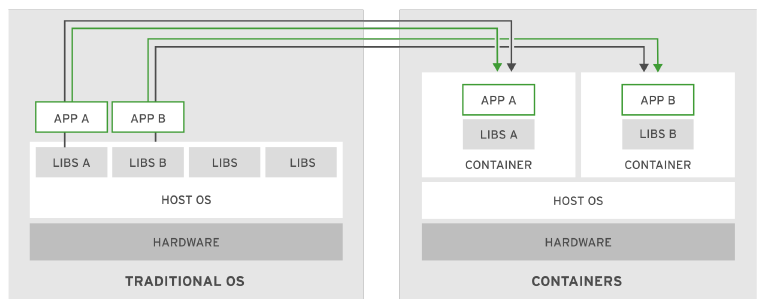

## 1.2. Tecnologia de contenedores 

De forma habitual las aplicaciones de software dependen de librerias, archivos de configuracion y servicios que son provistos por el ambiente donde corren (environment runtime). La forma tradicional es instalar el environment runtime y todas las dependencias en la maquina virtual o equipo fisico donde va a ser alojada la aplicacion. Por ejemplo, instalar el runtime de python 3.6, pip y todas sus dependencias.

Este metodo trae algunos problemas cuando por ejemplo ser realizan actualizaciones del sistema, cuando son portadas a otras maquinas, o cuando se eliminan dependencias. En el momento de la actualizacion, es probable que la aplicacion deba bajarse para poder proceder. Esto trae bajas de servicio que no son deseadas.

Alternativamente las aplicaciones pueden ser desplegadas en contenedores. Un contenedor es un set de uno o mas procesos de manera aislada del resto del sistema. Los contendores proveen los mismo beneficios que las maquinas virtuales como seguridad, storage, networking aislado.

Los contenedores requieren menos recursos de hardware, el tiempo de start y stop es mucho menor. Tambien pueden aislarse a nivel recursos como Memoria y CPU.

Los contenedores no solo ayudan con la eficiencia, elasticidad y reusabilidad, sino que tambien la portabilidad. 

### OCI Specification
Open Container Initiative (OCI) proporciona un conjunto de estándares de la industria que definen dos estandares:

- image-spec: Las especificaciones de imagenes definen como sera el formato del bundle de archivos y metadata que tendra la imagen de un contenedor. 
- runtime-spec: Algunos de los runtime disponibles son containerd, CRI-O, Firecracker, lxd, runc, docker, podman.

### Ventajas del uso de contenedores
- Low hardware footprint
- Environment isolation
- Quick deployment 
- Multiple environment deployment
- Reusability

Por esto mismo son un approcah ideal al pensar aplicaciones con arquitectura de microservicios. Cada servicio es encapsulado en un contenedor.

Reference:
- [opencontainers.org](#https://opencontainers.org/)
- [CNCF Landscape](#https://landscape.cncf.io/category=container-runtime&format=card-mode&grouping=category)