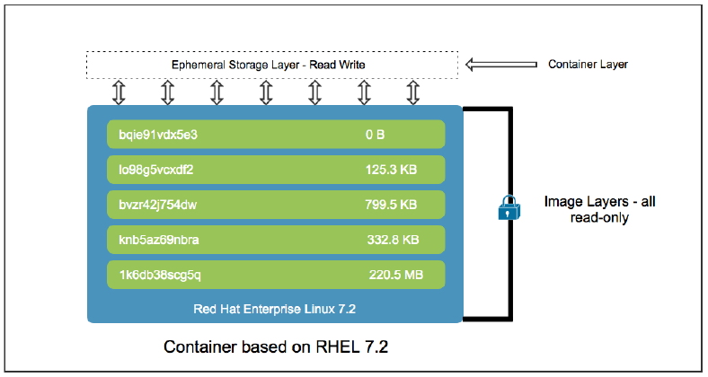

## 1.6. Persistent Storage <a name="1.6"></a>

Se dice que el storage de los contenedores es efimero, esto significa que el contenido no persiste tras un reinicio. Las aplicaciones en contenedores asumen que el storage sobre el cual trabajan esta vacio, esto permite que los contenedores puedan destruirse y crearse inesperadamente.

Hasta ahora las imagenes de los contenedores se caraterizaban por ser inmutables y por capas, esto significa que no cambian, sino que se componen por layer que anulan el contenido de la capa anterior. 

Un contenedor cuando se ejecuta, crea un nuevo layer sobre la base del original, este layer es el container storage. Este storage es usado para poder crear archivos temporales de lectura y escritura, logs, etc. Estos archivos son considerados efimeros. Ahora bien, un mismo conteiner puede ser detenido (stop) y ejecutado nuevamente (start) y la informacion efimera sigue. No asi si es elimiado (rm). Ahora bien si deseamos lanzar una nueva replica desde la misma imagen esta informacion base sera la misma pero la efimera solo se mantendra con el contenedor que esta corriendo. Podemos hacer la siguiente prueba.

Lanzamos un contenedor 
```
sudo podman run -d --name httpd-1 rhscl/httpd-24-rhel7
sudo podman exec -it httpd-1 /bin/bash
bash-4.2$ echo "Hola httpd-1" > /var/www/html/index.html
```

Podemos ver el archivo en el contenedor
```
bash-4.2$ cat /var/www/html/index.html
Hola httpd-1
bash-4.2$
```

Vemos el archivo efimero que hemos creado
```
ls -ltr $(podman inspect -l -f "{{.GraphDriver.Data.UpperDir}}")/var/www/html/
```

```
[gonza@centos ~]$ sudo su -
Last login: Mon Jun  1 18:21:13 EDT 2020 on pts/5
[root@centos ~]# ls -ltr $(podman inspect httpd-1 -f "{{.GraphDriver.Data.UpperDir}}")/var/www/html/
total 4
-rw-r--r--. 1 1001 root 13 Jun  1 18:51 index.html
[root@centos ~]# logout
[gonza@centos ~]$
```

Pero si lo eliminamos y lo volvemos a crear
```
sudo podman rm httpd-1
sudo podman run -d --name httpd-1 rhscl/httpd-24-rhel7
```
No esta el archivo que habiamos creado
```
[root@centos ~]# ls $(podman inspect httpd-1 -f "{{.GraphDriver.Data.UpperDir}}")/var/
log
[root@centos ~]#
```

Como vemos hasta aqui, el storage efimero no es suficiente para aplicaciones que necesitan persistir datos luego de un reinicio, ej. una base de datos. Para soportar esta necesidad el adminsitrador debe proveer storage persistente.

Persistent Storage


Los contenedores no deben persistir datos en el espacio efimero, no solo porque no hay un control de cuanto storage alojar sino porque debido a los layers no es performante para aplicaciones de alto io.

### Host Path

Podman puede montar directorios de host dentro del contenedor y fuera del espacio de storage efimero. De modo que los datos que se deseen persistir seran resguardados de manera segura.

Un contenedor se ejecuta como un proceso de sistema operativo, este proceso posee un user id y group id en el host. Los archivos que el utilice deben tener los permisos necesarios para poder ser accedidos. Podman en RHEL utilizar SELinux, `container_file_t`, para proteger el acceso de otros procesos a los archivos del contenedor. Esto evita fuga de inforamcion entre el host y las aplicaciones ejecutando dentro del contenedor.

### [Ejercicio Container Storage 1.6](#ejercicios/01/README.md)
