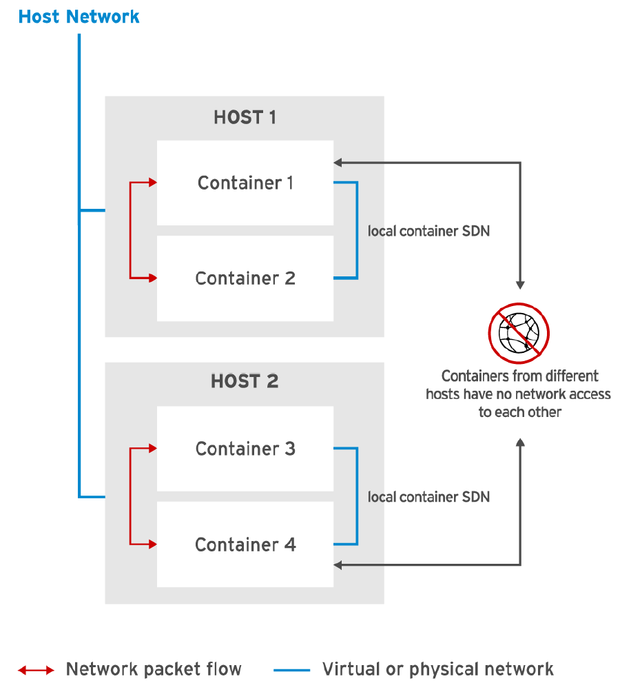
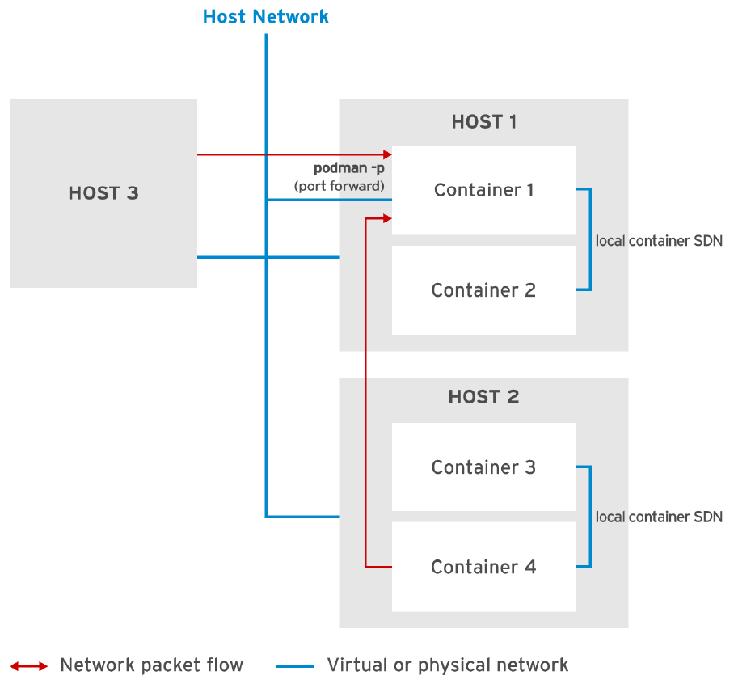

## Netwroking

#### CNI
La `Cloud Native Computing Fundation (CNCF)` sponsorea el proyecto open source `Contianer Network Interfaces (CNI)`. El proyecto tiene como objetivo estandarizar la interfaz de red de los contendores en entornos nativos de nube, como kubernetes y Openshift.

Podman usa CNI para implementar la software-define network (SDN) para contenedores en un host. Podman conecta cada contenedor a un virtual brindge y asigna a cada contenedor una ip privada. La configuracion de CNI esta alojada en /etc/cni/net.d/87-podman-bridge.conflist.

[source,shell]
----
[gonza@centos ~]$ cat /etc/cni/net.d/87-podman-bridge.conflist
{
    "cniVersion": "0.4.0",
    "name": "podman",
    "plugins": [
        {
            "type": "bridge",
            "bridge": "cni-podman0",
            "isGateway": true,
            "ipMasq": true,
            "ipam": {
                "type": "host-local",
                "routes": [
                    {
                        "dst": "0.0.0.0/0"
                    }
                ],
                "ranges": [
                    [
                        {
                            "subnet": "10.88.0.0/16",   <<< Subred definda para los pods>>>
                            "gateway": "10.88.0.1"      <<< Gateway definida en la subred>>>
                        }
                    ]
                ]
            }
        },
        {
            "type": "portmap",
            "capabilities": {
                "portMappings": true
            }
        },
        {
            "type": "firewall"
        }
    ]
}
[gonza@centos ~]$
----

#### Linux Container Network

Cuando un pod es creado se le asigna una ip de la red 10.88.0.0/16 en le host, este contenedor pude comunicarse libremente con otros containers por la ip de pods. Esta pequena topologia de red se la llama SDN de host. Los contendores creados con podman en host diferentes no pueden comunicarse entre ellos, las SDN de cada host son indipendientes. Es importante notar que todos los pods estan ocultos de la red del host. La red 10.88.0.0/16 es una red NO RUTEADA.

La ip del pod la podemos ver realizando el inspect.
----
sudo podman inspect -f '{{.NetworkSettings.IPAdrees}}' httpd-small
----

#### Port Mapping
Cuando el contenedor se crea, se asigna una ip address del pool de host. Esta estara disponible hasta que el pod muera. Una vez recreado el pod levanta con una nueva ip. Para poder comunicarse con el mundo exterior hay que realizar un `port mapping` o `port fowarding`. 

Con podman realizamos el port forwaring de la siguiente manera `-p [host ip address:][host port]<container port>` con `podman run`.

----
sudo podman run -d -p 8080:8080 --name httpd-small httpd:2.4
----

