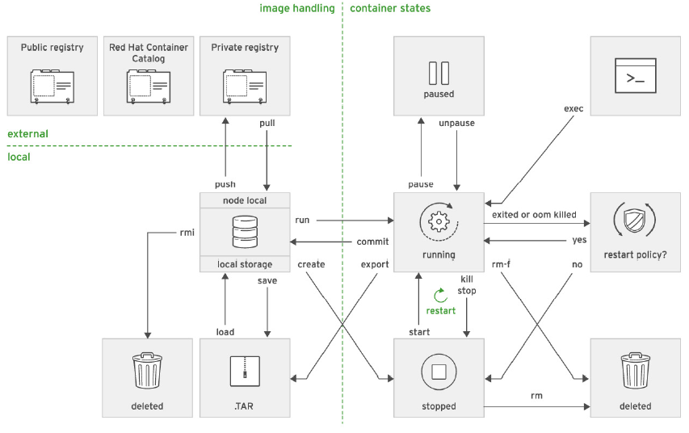
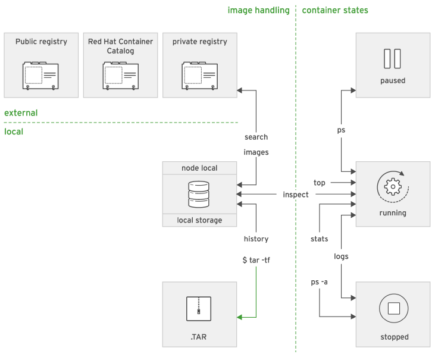

## Ciclo de vida de contenedores con podman

*Podman managing subcommands*


*Podman query subcommands*


### Resumen de comandos para administracion

Crear contenedor
```
sudo podman run rhscl/httpd-24-rhel7
```

Estado de contenedor
```
sudo podman ps -a
```

Comando dentro de contenedor
```
sudo podman exec httpd-small cat /etc/hostname
suod podman exec -l cat /etc/hostname
```

Inspeccionar metadata de contenedor. Output JSON
```
sudo podman inspect httpd-small
```

IPAdress de Contenedor
```
sudo podman inspect -f '{{.NetworkSettings.IPAdrees}}' httpd-small
```

Stop Container
```
sudo podman stop httpd-small
```

Enviar SIGNAL
```
sudo podman kill -s <SIGNAL ID> httpd-small
```

Restart
```
sudo podman restart httpd-small
```

Remover contenedor
```
sudo podman rm httpd-small
```

Remover imagen
```
sudo podman rmi <image id>
```

Logs
```
sudo podman logs httpd-small
```